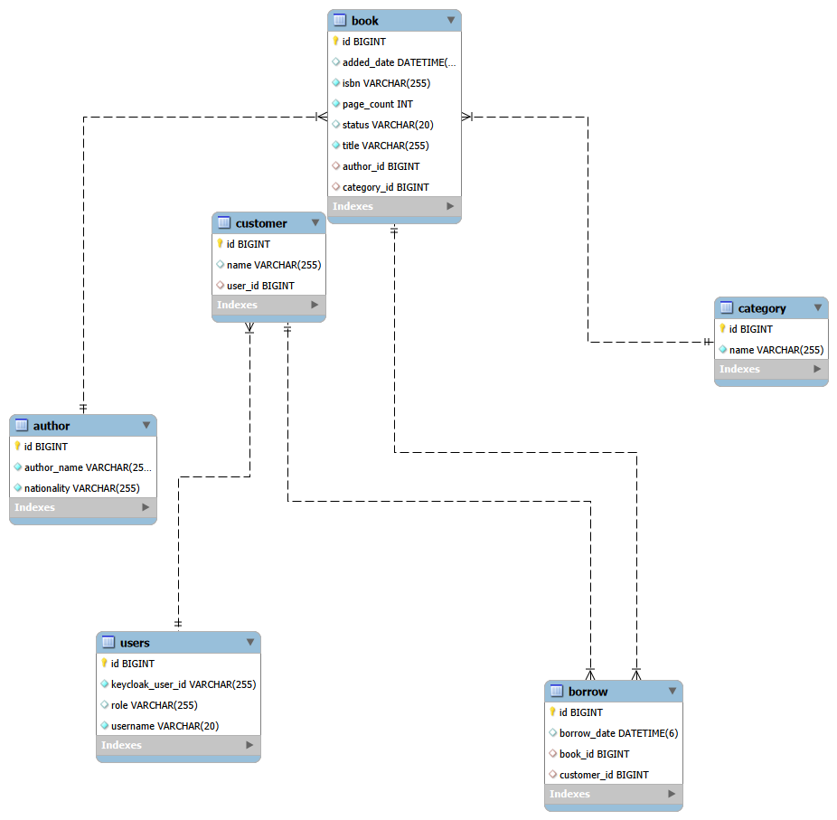
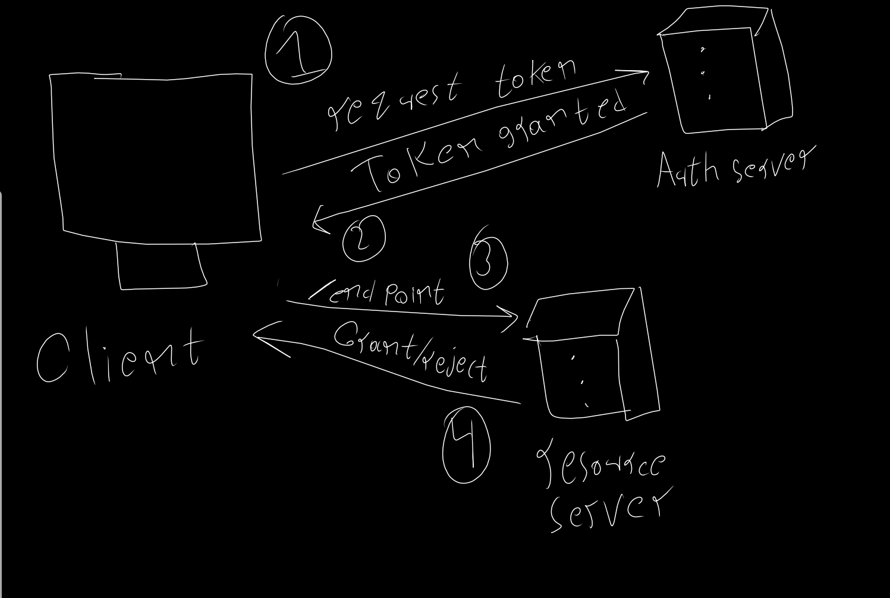
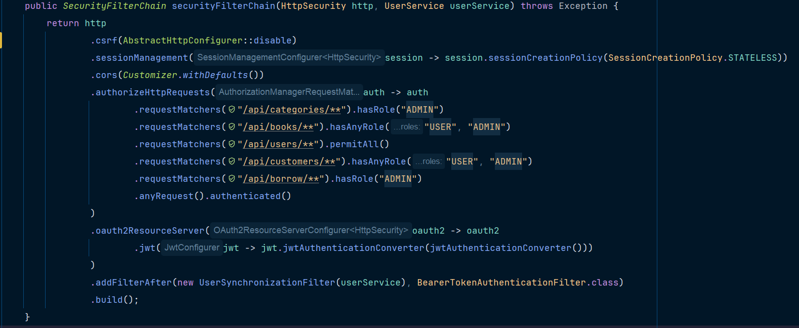
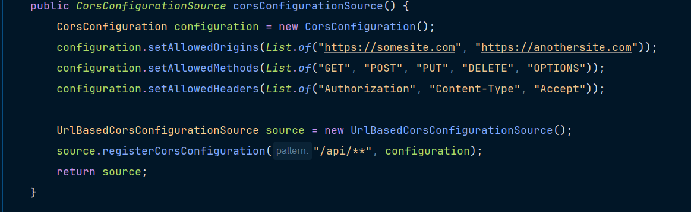
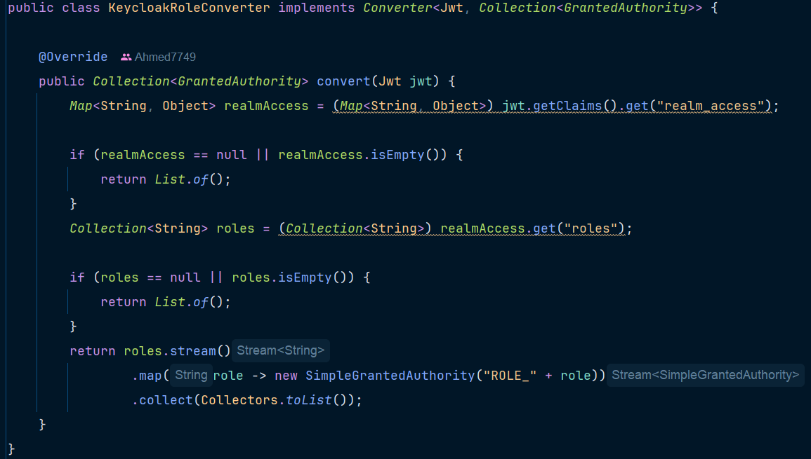
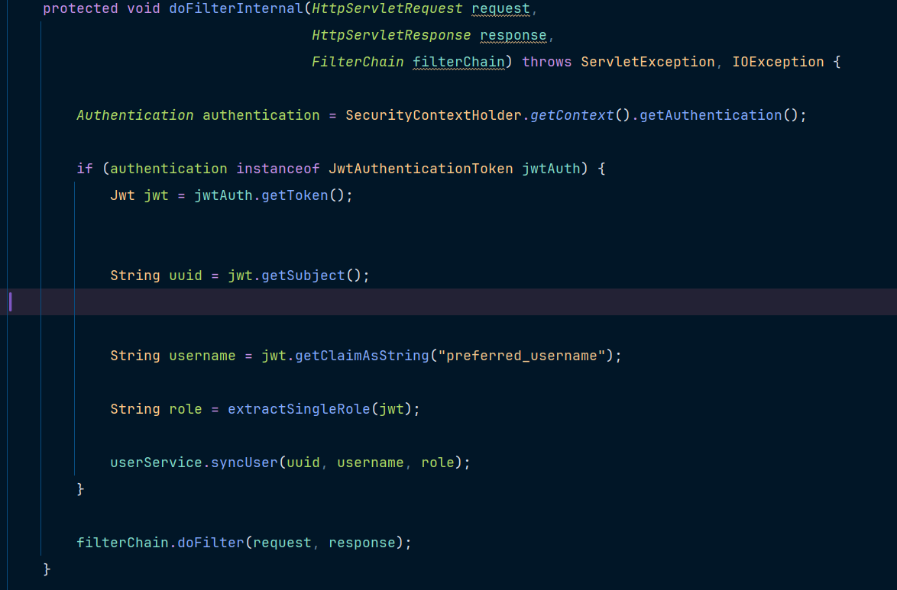
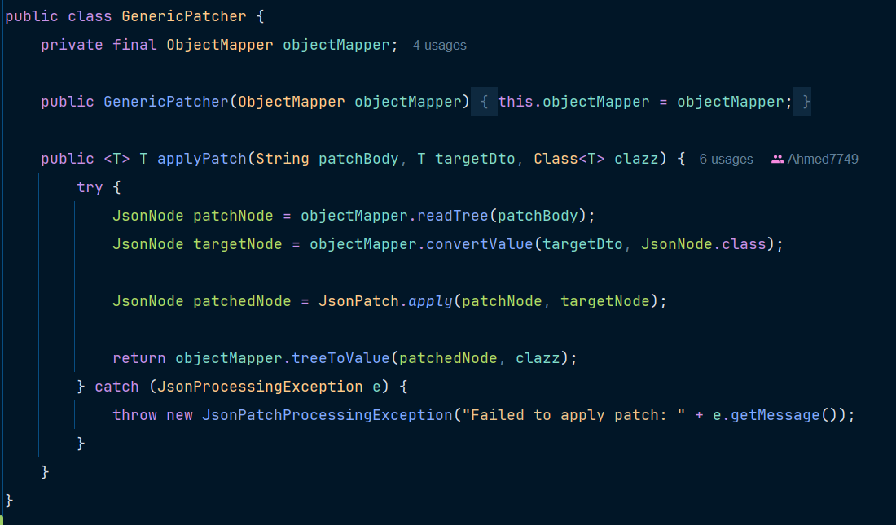
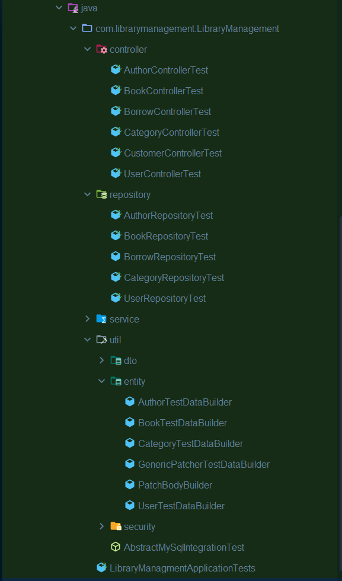

# Library management system REST API

___

## Table of contents

* [Database design](#database-design)
* [Design choice and layering](#design-choice-and-layering)
* [Security Layer](#security-layer)
* [Data access Layer](#data-access-layer)
* [Service Layer](#service-layer)
* [Controller Layer](#controller-layer)
* [API documentation](#api-documentation)
* [Testing](#testing)
* [Licence](#licence)
## Tech stack
* Spring boot 4.0.6
* Maven 
* Java 17 LTS
* MySql Database
* Jpa hibernate
* IntelliJ IDEA
* Keycloak authorization server
* Docker
* Junit5
* Mockito

## Database design
I used mysql workbench for database entity relationship model. **Crow's foot notation
has been used**

### Indexes: <br> 
* The user table has the keycloak uuid indexed alongside with the email (UNIQUE)
* All FKs and PKs are auto indexed by default in mySql workbench.

### Relationships
#### 1:N
Book - Author, at least one author for each book. and exactly one book for each author (a flaw in design i admit)
<br>
Book - Category, exactly one category for multiple books.
<br>
Customer - users, Each customer must be connected to exactly one user, and each user can have multiple customers
<br>
Customer - Borrow, a customer can borrow multiple books while a single borrow is exactly to one customer
<br>
Book - borrow, each book must be borrowed exactly once, however multiple books can be borrowed.

#### M:N
Book and customer has a many to many relationship in a join table called borrow.

## Design Choice and layering
Layered Architecture has been used for the project structure.
As shows:
```
LibraryManagement/
├── DB/                           # Database related files (e.g., ER diagrams)
│   └── ER.png
├── src/
│   ├── main/
│   │   ├── java/.../LibraryManagment/
│   │   │   ├── config/           # Configuration classes (e.g., Beans, Setup)
│   │   │   ├── Controllers/      # REST API endpoints (Presentation Layer)
│   │   │   ├── dto/              # Data Transfer Objects for client-server communication
│   │   │   ├── Entities/         # JPA Entities / Database Domain Models
│   │   │   ├── exception/        # Global exception handling and custom exceptions
│   │   │   ├── Repositories/     # Data Access Layer (Spring Data JPA interfaces)
│   │   │   ├── Security/         # Security configurations, filters, and authentication
│   │   │   ├── Services/         # Core business logic layer
│   │   │   ├── util/             # Utility classes and helper functions
│   │   │   └── LibraryManagementApplication.java # Spring Boot entry point
│   │   └── resources/            # Application properties and static resources
│   └── test/                     # Unit and integration testing directory
├── .gitignore                    # Git ignore rules
├── LMS_logger                    # Application logging output/configurations
├── pom.xml                       # Maven dependencies and build configuration
└── readme.md                     # Project documentation
```
The layering of the system is as shows <br>
Controller > Service > Repository

the controller itself uses mappers to benefit from the request DTO and response DTO

## Security Layer
For the choice of security the system used a stateless approach. <br>
We will begin in the flow for security for the security as shown from the diagram:

A simple overview for the structure of security in the JWT.
<br>
We will first cover the main components of security in the system: <br>
1- Security config
<br>
2- KeycloakRoleConverter
<br>
3- UserSynchronizationFilter

### Security Configuration: 
We will begin with the filter chain at first: 

* Disabling CSRF protection because each request will already require a JWT.
* The session management policy is set to stateless instead of a default stateful
* cors configuration (will be covered down)
* authorizing end points (Currently the roles are ADMIN, USER)
* Ensuring OAuth2 Resource server configuration and to ensure the converter is included (will be covered down)
* Adding the filter after the barrer token filter (will be covered down)

#### Cors config: 

Firstly we set the allowed origins as the main purpose of cors in general:
* Allowed origins as an example
* Allowed methods as an example
* allowed header as an example
<br>
Note: The reason why not using ( * ) is because it is a bad practice.

### KeycloakRoleConverter
#### Purpose of converter:
Keycloak has specific claims in the JWT <br>
most importantly is the realm-access claim which contains an array of roles
<br>
Spring expects a list which needs to be extracted and mapped.
<br>
As shown in the next image: 

Implementation for the Converter interface so we can map this to JwtConverter in the security config.
<br>
Firstly we implemented a map that maps the realm_access claim.
<br>
we check if the map is empty or null to return an empty list.
<br>
Then we extract a Collection of roles from the realm access (contains roles).
<br>
Our system unfortunately has a design flaw where the user has only a string of roles instead of a list

### UserSynchronizationFilter
#### Purpose of the filter: 
Our users in db has no track of their passwords. However, we keep track of their UUID that keycloak offers.
<br>
To sync that with our database alongside with the roles we also extracted. We will have to make this filter trigger after the token is recieved and converted
<br>
The filter is a onceperrquest filter. And it will map the details of the token 
specifically (username, roles, uuid)
<br>
using such helper methods to as much as possible make the code readable
As shown here:



## Data access layer
Data access layer (DAO) or repositories as what we refer to them currently
are the classes that whole purpose to communicate with the database.
We have repositories for all the entites covered in the [database design section](#database-design).
Each has the general methods JPArepository offers. And alongside with the required queries.
You can find them in each class as they are self-explanatory.
However, a thing worth explainning is this pattern you'll notice:
@Modifying
@Query("DELETE FROM Author a WHERE a.id = :id")
int deleteAuthorById(@Param("id") Long id);

the @modifying annotation is used to tell hibernate not to fetch a whole entity for the operation.
this optimizes better than the normal delete by id operations offered by JPA

## Service Layer
Service Layer is where the main business logic exists in. Each service class has the repository dependency in it alongside with 
the mappers needed. Author and Category use another class called GenericPatcher util class.

Code is generally self-explanatory. However, what's worth noting is the utillity class
GenericPatcher.
Here's the code: 

### Purpose: 
This class abstracts the duplication of code that used to exists in my code.

The methodology is simple. We take the objectMapper dependecy (bean defiend in JacksonConfig class)
And we have a generic method called ApplyPatch(PatchBody, T targetDto, Class<T> Clazz)

@param patchbody: It is going to be application/json-patch+json requet header
this specific type is mentioned in RFC6902

@param targetDTo is meant for the ResponseDTO to convert it to.

@param the class for the value to convert (response also)

The method of apply patch is so simple:
It takes a patchbody to read the tree into a node of JSON.
Then it converts the red node to the target node which would be the dto required (Response dto)
Then it turns it to the patched node in the JsonPatch.apply method.
Finally, we map the tree from the result JsonNode to the value of our target class.

On error the method will throw a custom JsonPatchProcessingException that gets handled in the global exception handler.

## Controller layer
Controllers are the main endpoint providers for our system.
we will cover in this section the:

[Author Controller](#author-controller)

[Book Controller](#book-controller)

[Borrow Controller](#borrow-controller)

[Category controller](#category-controller)

[Customer controller](#customer-controller)

[User controller](#user-controller)

Each of the controllers does not return the real entity of hibernate.

Instead. It returns a responseDto to replace that entity (service layer handles the mapping)

To begin with: 

### Author controller
general path: /api/authors (i admit it. no versioning is a bad practice. it should be something like /api/v1/author)

HTTP methods provided: GET, POST, DELETE, PATCH, PUT

### Book controller
general path: /api/books

HTTP methods provided: GET, POST

### Borrow controller
general path: /api/borrows

HTTP methods provided: GET, POST

### Category controller
general path: /api/categories

HTTP methods provided: GET, POST, DELETE, PATCH, PUT

### Customer controller
general path: /api/customers

HTTP methods provided: GET,POST

### User controller
general path: /api/users

HTTP methods provided: GET, POST

## API Documentation
This project uses springdoc-openapi to generate an OpenAPI 3 document
directly from the controllers — no hand-written spec to keep in sync.

* Interactive UI: `/swagger-ui.html`
* Raw document: `/v3/api-docs` (JSON) or `/v3/api-docs.yaml`

Authentication in the UI: paste a bearer token, or use the Authorize
button's OAuth2 flow if a `library-swagger-ui` public client is
registered in Keycloak with redirect URI
`/swagger-ui/oauth2-redirect.html`.

Every endpoint documents the realm role it requires and its possible
response codes, including the shared `ApiError` body used across the
project's exception handling.


## Testing
A rare thing to see and notice in self-made projects yet i planed to include it in my own.
I will discuss the: 

* [types of testing currently](#types-of-testing)
* [pattern used](#pattern-used)

### types of testing
#### Unit testing:<br> 
* using junit 5 along side with mockito and AsserJ to ensure quality and validation roles and business roles are met.
* Unit testing scope: service layer

#### Sliced testing
* WebMvcTest on controllers mainly
* DataJpaTest on repositories only for specific custom and join queries. Using test containers.
### pattern used
I used the AAA pattern Arrange Act Assert. I learned it from Testing Spring Boot Applications Dymistified Book by Philip Riecks
I used also from what i learned a beautiful approach where i used Builders
They help reduce manually inserting data for each object. Epically it follows the Effective java approach where using static method instead of constructors
<br>

The testing directory looks as so: 

## Licence
This project is ok to use everywhere since it's an educational project.